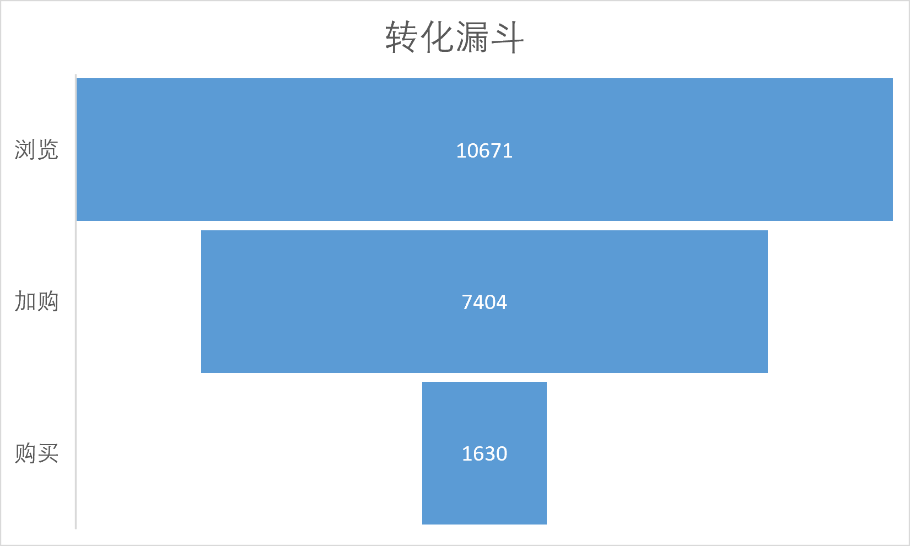
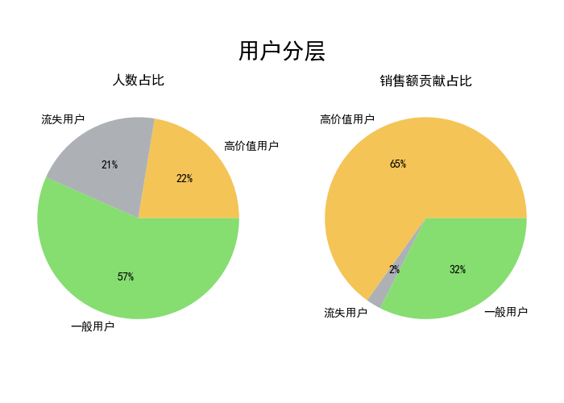

# 电商用户分析项目

## 项目概述：
本项目从**转化效率**和**用户价值**两个角度，对电商用户行为进行数据分析。

## 数据来源：
数据集1：kaggle——E-commerce user data（用于转化漏斗）
数据名称：UserBehavior--1.csv(42.14MB)

数据集2：kaggle——E-Commerce Data（用于RFM用户分层） 
数据名称：data.csv(45.58MB)

## 一、用户转化路径分析（转化漏斗）
#### 分析思路
浏览→加购→购买

#### 分析结果
|转化路径|转化率|
|:---|:---|
|浏览→加购|31%|
|加购→购买|22%|

## 二、用户价值分层分析（RFM）

#### 分析思路
R：最近消费
F：消费频率
M：消费金额

#### 分析结果
|用户分层|占比|销售额贡献|
|:---|:---|:---|
|高价值用户|22%|65%|
|一般用户|57%|32%|
|流失用户|21%|2%|

注：销售额贡献和为99%，是四舍五入导致的。

## 三、综合建议
1.针对高价值用户：加购后1小时内推送专属优惠券
2.针对流失用户：送大额召回券

